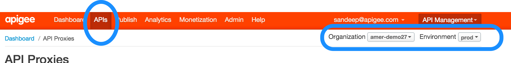

# Demo Script: Cosafinity

`Cosafinity` is a fictious retail company that sells multiple products over web, mobile, partner channels.

##Demo Environment
- Edge Management 
 - Login: https://edge.apigee.com
 - Org: amer-demo27
- API BaaS 
 - Login: https://appservices.apigee.com
 - Org: amer-demo27
- Developer Portal
 - Login: http://dev-amer-demo27.devportal.apigee.com/
 - Use 'Authenticate with Apigee' on login from top right

#Demo Flow: 

The demo will have 4 different parts/acts, that talk about

1. API Onboarding, API Policy Framework, Operational metrics around API Usage
2. API BaaS that can augment the existing service set, to enable an enterprise to build additional capabilities in thier apps, typically mobile apps
3. Partner/Developer onboarding, business readiness of the APIs
4. API Analyitcs, to view/measure the sucess of the API Program

## Act 1
- Login to Management UI - https://edge.apigee.com, Org: `amer-demo27`

- Go to `APIs` Tab on the top 

On the top right, you will see the org and env drop down. Use that to talk about Apigee's multi tenancy and how it helps enterprises to manage multiple projects with shared, dedicated, one DC, multiple DC scenarios.

The Cosafinity API is powering all the mobile, IOT and partner channels. 
Corrosponding to that you will see the APIs around `catalogs`, `products`, `stores`, `offers` etc
- Talk about the operational analytics that you see on the dashboard.
At this point stress up on the importance of operational metrics for the API owners, in a scenario where thier API is used by other teams, other partners. 
- Optional: Create an API Proxy
Show how an API can be on-boarded to the org. 
The best way to do that is, create an API Proxy from an existing/sample WSDL
	- Talk about the Facade pattern, and the ability to abstract the complixity of the backend and create a RESTful API, with a proper version number, resources etc
- Open an existing API Proxy `products`. Go to `Develop` tab to show the policy framework
- The `productdetails` resource is a simple passthrough, sending the request to the backend service
- The `CreateProductReviews` is a more interesting usecase
For the demo, the scenario is `Cosafinity` is a traditional brick and mortor retailer and they do not have a lot of social capabilities around giving users ability to review the products. In order to compete with the digital natives, they want to include this functionality in thier mobile App, but they do not have a backend service to store the reviews. 

If you plan to show API BaaS Separately, introduce this example and cover API BaaS in depth later. If not, you can use this example to talk about how API BaaS can be used to extend the existing services a customer might have

- At the 'PreFlow' level you will see policies like 'API Key Valiadation', 'OAuth' etc. 
At this point talk about the policy Framework, add a step to show the policies available. Talk about the Out Of the Box policies as well as extension policies

## Act 2 - API BaaS
This is optional, and you will do it only if you have enough time in the demo. 
Login to https://appservices.apigee.com Org: `amer-demo27` App: `cosafinity`
Show the data model 
Show the stores entity with Locaion quries

## Act 3 - Developer Onboarding
At this point you would have walked through the API on-boarding. The API is operationally ready, with unified security, traffic management across different heterogeneous backend systems.

Now the next challenge is- how do you make this API ready from a Business standpoint.
- Go to Publish tab 
- Walk through API Products
An API Product is a bundle of API proxies combined with a service plan that sets limits on access to those APIs. API products are the central mechanism that Apigee Edge uses for authorization and access control to your APIs. For more, see [API Products](http://apigee.com/docs/developer-services/content/what-api-product)
- Go to the developer portal: http://dev-amer-demo27.devportal.apigee.com/
Show how a developer can signup and get access to the API
- A good reference portal to show is: https://developer.payeezy.com
It has Smartdocs well configured in 'Docs & Sandbox' tab on the top. This will give the customer an idea of how their Partners, internal/external developers will experience their API

## Act 4 - Analytics
- Come back to Management UI - https://edge.apigee.com, Org: `amer-demo27`
- Show the dashboard
- Analytics tab - Latency Analysis
- Analytics tab - Custom Analysis
